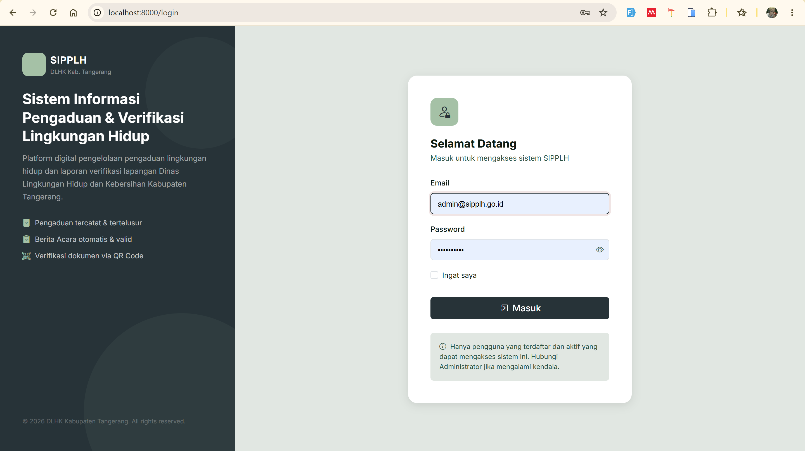
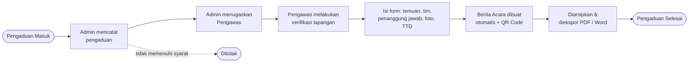
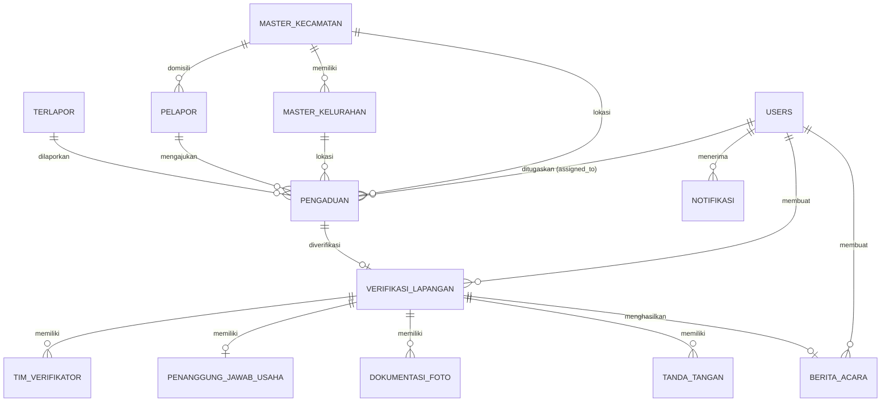

<div align="center">

# 🌿 SIPPLH

### Sistem Informasi Pengelolaan Pengaduan dan Verifikasi Lapangan Lingkungan Hidup

**Dinas Lingkungan Hidup dan Kebersihan (DLHK) Kabupaten Tangerang**

Platform web untuk mengelola pengaduan lingkungan hidup, melakukan verifikasi lapangan secara digital, dan menerbitkan Berita Acara otomatis yang dapat divalidasi melalui QR Code.


</div>

---

## 📑 Daftar Isi

- [Tentang Project](#-tentang-project)
- [Latar Belakang](#-latar-belakang)
- [Tujuan Sistem](#-tujuan-sistem)
- [Tampilan Aplikasi](#-tampilan-aplikasi)
- [Fitur Utama](#-fitur-utama)
- [Role dan Hak Akses](#-role-dan-hak-akses)
- [Alur Kerja Sistem](#-alur-kerja-sistem)
- [Teknologi yang Digunakan](#-teknologi-yang-digunakan)
- [Arsitektur Docker](#-arsitektur-docker)
- [Struktur Direktori](#-struktur-direktori)
- [Struktur Database](#-struktur-database)
- [Daftar Route](#-daftar-route)
- [Instalasi dan Menjalankan Project](#-instalasi-dan-menjalankan-project)
- [Penomoran Otomatis](#-penomoran-otomatis)
- [Verifikasi Berita Acara via QR Code](#-verifikasi-berita-acara-via-qr-code)
- [Status Pengembangan](#-status-pengembangan)
- [Keamanan](#-keamanan)
- [Kontributor](#-kontributor)

---

## 📖 Tentang Project

**SIPPLH** (Sistem Informasi Pengelolaan Pengaduan dan Verifikasi Lapangan Lingkungan Hidup) adalah aplikasi berbasis web yang dibangun untuk mendigitalkan seluruh proses penanganan pengaduan lingkungan hidup di **Dinas Lingkungan Hidup dan Kebersihan Kabupaten Tangerang**, mulai dari pencatatan pengaduan, penugasan petugas, verifikasi lapangan, penerbitan Berita Acara, hingga pengarsipan dan pelaporan.

Sebelumnya, seluruh proses tersebut dikerjakan secara manual menggunakan dokumen Microsoft Word. Dengan SIPPLH, data pengaduan tersimpan terpusat, Berita Acara dibuat otomatis mengikuti template resmi DLHK, dan progres setiap pengaduan dapat dipantau kapan saja melalui dashboard.

---

## 🧩 Latar Belakang

Saat ini proses verifikasi lapangan pengaduan lingkungan hidup di DLHK Kabupaten Tangerang masih dilakukan secara manual menggunakan dokumen Microsoft Word. Kondisi ini menimbulkan berbagai kendala dalam pengelolaan data pengaduan dan pelaporan hasil verifikasi lapangan.

| No | Kendala Saat Ini | Solusi yang Ditawarkan SIPPLH |
|----|------------------|-------------------------------|
| 1 | Berita Acara Hasil Verifikasi Lapangan dibuat manual menggunakan Microsoft Word | Berita Acara dibuat **otomatis** berdasarkan template resmi DLHK dari data verifikasi yang sudah diinput |
| 2 | Tidak ada rekapitulasi pengaduan berdasarkan kategori kasus | **Dashboard statistik** dan modul laporan dengan rekap per kategori, status, dan periode |
| 3 | Sulit mencari data pengaduan lama karena dokumen tersimpan terpisah | **Pencarian dan filter** data pengaduan dalam satu database terpusat |
| 4 | Berita Acara tidak dapat diakses secara digital oleh seluruh tim teknis | Berita Acara tersimpan sebagai **arsip digital** yang dapat diakses sesuai hak akses |
| 5 | Tidak ada dashboard monitoring jumlah pengaduan dan status tindak lanjut | **Dashboard real-time** berisi kartu statistik, grafik tren bulanan, dan grafik status |
| 6 | Pembuatan laporan lama karena harus mengetik ulang data | Data diinput **sekali**, lalu dipakai ulang untuk Berita Acara dan laporan |
| 7 | Tidak ada arsip digital yang terstruktur dan mudah ditelusuri | Arsip terstruktur dengan **nomor pengaduan dan nomor BA otomatis** |
| 8 | Sulit mengetahui progres penyelesaian setiap pengaduan | **Status pengaduan bertahap** (Masuk → Diproses → Verifikasi → Selesai/Ditolak) beserta tenggat tindak lanjut |

---

## 🎯 Tujuan Sistem

Membangun aplikasi berbasis web yang digunakan untuk:

- ✅ Mengelola data pengaduan lingkungan hidup.
- ✅ Melakukan verifikasi lapangan secara digital.
- ✅ Membuat Berita Acara otomatis berdasarkan template resmi DLHK.
- ✅ Menyimpan arsip digital seluruh Berita Acara.
- ✅ Menampilkan dashboard statistik pengaduan.
- ✅ Mengekspor laporan ke **PDF, Word, dan Excel**.
- ✅ Mempermudah monitoring tindak lanjut pengaduan.

---

## 🖼️ Tampilan Aplikasi

### Halaman Login

Halaman masuk dengan tampilan dua panel: panel kiri berisi identitas dan ringkasan keunggulan sistem, panel kanan berisi form autentikasi (email, password, opsi *Ingat saya*, dan tombol tampil/sembunyikan password). Hanya pengguna yang terdaftar dan berstatus aktif yang dapat masuk ke sistem.



<!--
Tambahkan screenshot lain dengan format berikut setelah file gambarnya
disimpan di folder docs/screenshots/ :

### Dashboard Administrator


### Daftar Pengaduan


### Form Verifikasi Lapangan


### Berita Acara (Preview)


### Halaman Verifikasi QR Code

-->

---

## ✨ Fitur Utama

### 1. Autentikasi dan Manajemen Akses
- Login dengan email dan password, dilengkapi opsi **Ingat saya** dan fitur *show/hide password*.
- Pembatasan akses berbasis **role** menggunakan middleware (`admin` dan `pengawas`).
- Akun dapat **diaktifkan/dinonaktifkan** oleh Administrator; hanya akun aktif yang dapat masuk.
- Sesi pengguna disimpan di database.

### 2. Dashboard dan Monitoring
- **Kartu statistik** jumlah pengaduan: Total, Masuk, Diproses, Verifikasi, Selesai, dan Ditolak.
- **Grafik tren bulanan** jumlah pengaduan sepanjang tahun berjalan (line chart).
- **Grafik status pengaduan** (doughnut chart).
- Tabel **5 pengaduan terbaru** beserta status dan aksi cepat.
- Panel **notifikasi** pada topbar untuk pemberitahuan yang belum dibaca.

### 3. Manajemen Pengaduan
- Pencatatan pengaduan lengkap: tanggal, kategori kasus, uraian, lokasi kejadian, kecamatan, kelurahan/desa, dan koordinat lokasi (latitude/longitude).
- Data **pelapor** (mendukung pelapor **anonim**) dan data **terlapor** (perusahaan, individu, atau instansi).
- **Nomor pengaduan otomatis** dengan format standar.
- Unggah **dokumen pendukung** pengaduan.
- **Penugasan (assign)** pengaduan kepada Pengawas Lingkungan Hidup.
- **Pembaruan status** pengaduan secara bertahap, serta catatan admin.

### 4. Verifikasi Lapangan Digital
- Form verifikasi lapangan yang diisi langsung oleh Pengawas berdasarkan pengaduan yang ditugaskan.
- Isian mengikuti struktur Berita Acara resmi:
  - **Informasi Administrasi** (Bagian C)
  - **Fakta Temuan** (Bagian D)
  - **Saran Tindak Lanjut** (Bagian E) beserta **tenggat tindak lanjut** (14 hari)
- **Tim Verifikator**: nama, NIP, pangkat, jabatan, dan urutan.
- **Penanggung Jawab Usaha/Kegiatan**: nama, jabatan, perusahaan, alamat, bidang usaha, **KBLI**, **NIB**, koordinat, telepon, dan email.
- **Dokumentasi foto** lapangan dengan keterangan dan pengurutan.
- **Tanda tangan digital** (verifikator, penanggung jawab, dan saksi) yang digambar langsung pada canvas.
- Status verifikasi **draft** dan **selesai** (*finalize*).

### 5. Berita Acara Otomatis
- Berita Acara dihasilkan otomatis dari data verifikasi lapangan sesuai **template resmi DLHK**.
- **Nomor BA otomatis** dan **token QR Code unik** untuk setiap dokumen.
- **Preview** sebelum diterbitkan, lalu unduh dalam format **PDF** dan **Word (.docx)**.
- Status dokumen **draft** dan **final**.
- **Arsip digital** seluruh Berita Acara yang dapat ditelusuri kembali.

### 6. Laporan dan Ekspor
- Rekapitulasi pengaduan berdasarkan kategori, status, dan periode.
- Ekspor laporan ke **Excel** dan **PDF**; Berita Acara dapat diekspor ke **PDF** dan **Word**.

### 7. Manajemen User dan Master Data
- CRUD pengguna (nama, email, role, NIP, jabatan, nomor telepon, foto profil) dan aktif/nonaktif akun.
- Master data **Kecamatan** dan **Kelurahan/Desa** yang digunakan pada form pengaduan.

### 8. Validasi Dokumen via QR Code
- Setiap Berita Acara memiliki QR Code yang mengarah ke halaman verifikasi **publik** (tanpa login) untuk memastikan keaslian dokumen.

---

## 👥 Role dan Hak Akses

| Role | Deskripsi | Hak Akses |
|------|-----------|-----------|
| **Administrator** (`admin`) | Pengelola sistem | Akses **penuh** ke seluruh modul: dashboard, pengaduan, verifikasi, berita acara, laporan, manajemen user, dan master data |
| **Pengawas Lingkungan Hidup** (`pengawas`) | Petugas lapangan | Melihat tugas yang ditugaskan kepadanya, **melakukan verifikasi lapangan**, mengisi hasil pemeriksaan, mengunggah foto dokumentasi, dan **membuat Berita Acara**, serta mengelola profil sendiri |

> 💡 Kolom `role` pada tabel `users` juga menyediakan nilai `viewer` (default) sebagai cadangan untuk pengembangan selanjutnya. Middleware `PengawasMiddleware` mengizinkan akses bagi `admin` **dan** `pengawas`, sedangkan `AdminMiddleware` hanya untuk `admin`.

---

## 🔄 Alur Kerja Sistem



**Siklus status pengaduan**

| Status | Arti |
|--------|------|
| `masuk` | Pengaduan baru tercatat di sistem |
| `diproses` | Pengaduan sedang ditindaklanjuti / sudah ditugaskan |
| `verifikasi` | Verifikasi lapangan sedang/sudah dilakukan |
| `selesai` | Pengaduan telah selesai ditangani |
| `ditolak` | Pengaduan tidak dapat ditindaklanjuti |

---

## 🛠️ Teknologi yang Digunakan

| Kategori | Teknologi |
|----------|-----------|
| **Backend** | PHP 8.2+, Laravel 11+ |
| **Frontend** | Blade Template, Bootstrap 5.3, Bootstrap Icons, CSS kustom |
| **Visualisasi Data** | Chart.js 4 |
| **Database** | MySQL 8.0 |
| **Cache / Queue** | Redis (Alpine) |
| **Web Server** | Nginx (Alpine) + PHP-FPM |
| **Containerization** | Docker & Docker Compose |
| **Tipografi** | Inter (Google Fonts) |
| **Ekspor Dokumen** | PDF, Word (.docx), dan Excel (.xlsx) |
| **Otomasi Setup** | Shell script (`setup_sipplh.sh`, `setup_ui.sh`) |

**Komposisi bahasa repositori:** Blade ± 56%, PHP ± 28%, Shell ± 13%, CSS ± 2%.

---

## 🐳 Arsitektur Docker

Aplikasi dijalankan sebagai empat container yang saling terhubung dalam satu jaringan (`sipplh_network`).

| Service | Container | Image | Fungsi | Port |
|---------|-----------|-------|--------|------|
| `app` | `sipplh_app` | Build dari `docker/php/Dockerfile` | PHP-FPM menjalankan aplikasi Laravel | – |
| `webserver` | `sipplh_nginx` | `nginx:alpine` | Web server / reverse proxy | **8000** → 80 |
| `db` | `sipplh_db` | `mysql:8.0` | Database MySQL (`sipplh_db`) | **3306** |
| `redis` | `sipplh_redis` | `redis:alpine` | Cache dan antrean | – |

Data MySQL disimpan pada volume Docker `sipplh_dbdata` sehingga tidak hilang saat container dihentikan.

---

## 📁 Struktur Direktori

```text
Project_SIPPLH/
├── docker/
│   ├── nginx/
│   │   └── default.conf              # Konfigurasi Nginx
│   └── php/
│       ├── Dockerfile                # Image PHP-FPM aplikasi
│       └── php.ini                   # Konfigurasi PHP kustom
├── docs/
│   └── screenshots/                  # Screenshot untuk README
├── src/                              # Source code aplikasi Laravel
│   ├── app/
│   │   ├── Exports/                  # Kelas ekspor laporan (Excel)
│   │   ├── Helpers/                  # Fungsi bantu (helper) aplikasi
│   │   ├── Http/
│   │   │   ├── Controllers/
│   │   │   │   ├── Admin/            # Controller modul Administrator
│   │   │   │   ├── Auth/             # Controller autentikasi (login/logout)
│   │   │   │   ├── Pengawas/         # Controller modul Pengawas
│   │   │   │   └── Controller.php    # Base controller
│   │   │   ├── Middleware/           # AdminMiddleware, PengawasMiddleware
│   │   │   └── Requests/             # Form Request (validasi input)
│   │   ├── Models/                   # Model Eloquent
│   │   ├── Providers/                # Service provider
│   │   ├── Repositories/             # Lapisan akses data (query database)
│   │   ├── Services/                 # Lapisan logika bisnis
│   │   └── Support/                  # Kelas pendukung
│   ├── bootstrap/                    # Bootstrap framework Laravel
│   ├── config/                       # File konfigurasi aplikasi
│   ├── database/
│   │   ├── migrations/               # Skema database
│   │   └── seeders/                  # UserSeeder, DatabaseSeeder
│   ├── public/                       # Entry point web dan aset publik
│   ├── resources/
│   │   ├── css/                      # Sumber CSS
│   │   ├── js/                       # Sumber JavaScript
│   │   └── views/
│   │       ├── admin/                # Tampilan modul Administrator
│   │       ├── auth/                 # Halaman login
│   │       ├── components/           # Komponen Blade yang dapat dipakai ulang
│   │       ├── layouts/              # Layout utama (sidebar, topbar)
│   │       ├── partials/             # Potongan tampilan (partial)
│   │       ├── pdf/                  # Template dokumen PDF (Berita Acara, laporan)
│   │       ├── pengawas/             # Tampilan modul Pengawas
│   │       ├── public/               # Halaman publik (verifikasi QR Code)
│   │       └── welcome.blade.php
│   └── routes/
│       ├── admin.php                 # Route khusus Administrator
│       ├── console.php               # Perintah Artisan / console
│       ├── pengawas.php              # Route khusus Pengawas
│       └── web.php                   # Route utama, autentikasi, dan verifikasi QR
├── docker-compose.yml                # Orkestrasi container
├── setup_sipplh.sh                   # Script fondasi backend (migration, model, route, seeder)
├── setup_ui.sh                       # Script UI (login, layout, dashboard)
└── README.md
```
> 📝 Struktur di atas hanya menampilkan folder utama. Folder bawaan Laravel lainnya (seperti `storage`, `tests`, dan `vendor`) tidak dicantumkan.

### Pola Arsitektur

Aplikasi memisahkan tanggung jawab ke dalam beberapa lapisan agar kode mudah dirawat dan dikembangkan:

| Lapisan | Lokasi | Peran |
|---------|--------|-------|
| **Route** | `routes/` | Memetakan URL ke controller, dipisah per role (`admin.php`, `pengawas.php`) |
| **Middleware** | `app/Http/Middleware` | Membatasi akses berdasarkan role pengguna |
| **Request** | `app/Http/Requests` | Validasi input form sebelum masuk ke controller |
| **Controller** | `app/Http/Controllers` | Menerima request dan mengembalikan tampilan/respons, dikelompokkan per modul (`Admin`, `Auth`, `Pengawas`) |
| **Service** | `app/Services` | Logika bisnis (misalnya alur verifikasi dan pembuatan Berita Acara) |
| **Repository** | `app/Repositories` | Akses dan query data ke database |
| **Model** | `app/Models` | Representasi tabel dan relasi Eloquent |
| **Export** | `app/Exports` | Pembuatan file laporan yang diekspor |
| **View** | `resources/views` | Tampilan Blade per role, plus template `pdf` untuk dokumen cetak |

---

## 🗄️ Struktur Database

Database `sipplh_db` terdiri atas tabel-tabel berikut.

| Tabel | Fungsi |
|-------|--------|
| `users` | Akun pengguna (admin, pengawas, viewer), NIP, jabatan, status aktif |
| `password_reset_tokens`, `sessions` | Reset password dan sesi login |
| `master_kecamatan` | Master data kecamatan |
| `master_kelurahan` | Master data kelurahan/desa (relasi ke kecamatan) |
| `pelapor` | Data pelapor, termasuk opsi anonim |
| `terlapor` | Data pihak terlapor (perusahaan/individu/instansi) |
| `pengaduan` | Data utama pengaduan, kategori, lokasi, koordinat, status, dan penugasan |
| `verifikasi_lapangan` | Hasil verifikasi (informasi administrasi, fakta temuan, saran, tenggat) |
| `tim_verifikator` | Anggota tim verifikator per verifikasi |
| `penanggung_jawab_usaha` | Data penanggung jawab usaha/kegiatan (KBLI, NIB, koordinat) |
| `dokumentasi_foto` | Foto dokumentasi lapangan |
| `tanda_tangan` | Tanda tangan digital (verifikator, penanggung jawab, saksi) |
| `berita_acara` | Berita Acara: nomor, token QR, path file PDF/DOCX, status |
| `notifikasi` | Notifikasi untuk pengguna |

### Diagram Relasi (ERD)



---

## 🧭 Daftar Route

### Umum

| Method | URL | Keterangan |
|--------|-----|------------|
| GET | `/` | Redirect ke halaman login |
| GET / POST | `/login` | Form dan proses login (khusus tamu) |
| POST | `/logout` | Keluar dari sistem |
| GET | `/verify/{token}` | **Publik** – validasi keaslian Berita Acara via QR Code |

### Administrator — prefix `/admin` (middleware: `auth`, `admin`)

| Modul | Route |
|-------|-------|
| Dashboard | `admin/dashboard` |
| Pengaduan | resource `admin/pengaduan`, plus `PATCH .../status` dan `PATCH .../assign` |
| Verifikasi Lapangan | resource `admin/verifikasi`, plus `POST .../finalize` |
| Berita Acara | `admin/berita-acara` (index, create, store, show, destroy), `preview`, `download-pdf`, `download-doc`, `finalize` |
| Laporan | `admin/laporan`, `export-excel`, `export-pdf` |
| Manajemen User | resource `admin/users`, plus `PATCH .../toggle-status` |
| Master Data | `admin/master/kecamatan`, `admin/master/kelurahan` |

### Pengawas — prefix `/pengawas` (middleware: `auth`, `pengawas`)

| Modul | Route |
|-------|-------|
| Dashboard | `pengawas/dashboard` |
| Tugas | `pengawas/tugas` dan `pengawas/tugas/{pengaduan}` |
| Verifikasi | `create`, `store`, `edit`, `update` verifikasi lapangan |
| Foto Dokumentasi | upload dan hapus foto verifikasi |
| Profil | `pengawas/profil` (lihat dan ubah) |

---

## 🚀 Instalasi dan Menjalankan Project

### Prasyarat

- [Docker](https://docs.docker.com/get-docker/) dan Docker Compose
- [Git](https://git-scm.com/)
- Port **8000** dan **3306** tidak sedang dipakai aplikasi lain

### Langkah Instalasi

**1. Clone repositori**

```bash
git clone https://github.com/dfulndri/Project_SIPPLH.git
cd Project_SIPPLH
```

**2. Jalankan seluruh container**

```bash
docker compose up -d --build
```

**3. Siapkan file environment**

```bash
cp src/.env.example src/.env
```

Sesuaikan konfigurasi koneksi berikut pada `src/.env` agar cocok dengan `docker-compose.yml`:

```env
APP_NAME=SIPPLH
APP_URL=http://localhost:8000

DB_CONNECTION=mysql
DB_HOST=db
DB_PORT=3306
DB_DATABASE=sipplh_db
DB_USERNAME=sipplh_user
DB_PASSWORD=sipplh_pass

REDIS_HOST=redis
REDIS_PORT=6379
```

**4. Install dependensi dan siapkan aplikasi**

```bash
docker compose exec app composer install
docker compose exec app php artisan key:generate
docker compose exec app php artisan migrate --seed
docker compose exec app php artisan storage:link
docker compose exec app php artisan optimize:clear
```

**5. Buka aplikasi**

```text
http://localhost:8000/login
```

### Perintah Berguna

```bash
# Melihat status container
docker compose ps

# Melihat log aplikasi
docker compose logs -f app

# Masuk ke container aplikasi
docker compose exec app bash

# Menghentikan seluruh container
docker compose down

# Menghentikan container sekaligus menghapus data database
docker compose down -v
```

### Script Setup (opsional)

Repositori ini menyertakan dua script otomasi yang dijalankan dari root project:

| Script | Fungsi |
|--------|--------|
| `bash setup_sipplh.sh` | Menulis ulang migration, model, middleware, route, dan seeder (fondasi backend) |
| `bash setup_ui.sh` | Membuat halaman login, layout admin (sidebar dan topbar), dashboard, dan stylesheet |

> ⚠️ Kedua script menimpa file yang sudah ada. Gunakan hanya saat menyiapkan project dari awal, dan **jangan dijalankan pada project yang sudah Anda modifikasi**.

---

## 🔢 Penomoran Otomatis

Sistem menghasilkan nomor secara otomatis dan berurutan per tahun.

| Dokumen | Format | Contoh |
|---------|--------|--------|
| Nomor Pengaduan | `PGD/{urut}/{BLN}/{tahun}` | `PGD/001/JUN/2026` |
| Nomor Berita Acara | `BA/{urut}/DLHK-KAB.TNG/{BLN}/{tahun}` | `BA/001/DLHK-KAB.TNG/JUN/2026` |

---

## 📱 Verifikasi Berita Acara via QR Code

Setiap Berita Acara memiliki **token acak 48 karakter** yang unik. Token ini dikodekan menjadi QR Code yang tercetak pada dokumen.

1. Pihak yang menerima dokumen memindai QR Code menggunakan kamera ponsel.
2. Pemindaian membuka halaman publik `/verify/{token}` tanpa perlu login.
3. Halaman menampilkan data Berita Acara yang tersimpan di sistem (nomor BA, pengaduan, dan terlapor) sebagai bukti bahwa dokumen **asli dan terdaftar** di DLHK Kabupaten Tangerang.

---

## 📊 Status Pengembangan

| Komponen | Status |
|----------|--------|
| Infrastruktur Docker (PHP-FPM, Nginx, MySQL, Redis) | ✅ Selesai |
| Skema database (14 tabel) dan relasi Eloquent | ✅ Selesai |
| Middleware role (`admin`, `pengawas`) | ✅ Selesai |
| Struktur route Administrator, Pengawas, dan QR publik | ✅ Selesai |
| Seeder akun demo | ✅ Selesai |
| Autentikasi dan halaman login | ✅ Selesai |
| Layout admin (sidebar, topbar) dan dashboard statistik | ✅ Selesai |
| Modul CRUD Pengaduan | 🚧 Dalam pengembangan |
| Modul Verifikasi Lapangan (form, foto, tanda tangan digital) | 🚧 Dalam pengembangan |
| Generator Berita Acara (PDF/Word) dan QR Code | 🚧 Dalam pengembangan |
| Modul Laporan dan ekspor Excel/PDF | 🚧 Dalam pengembangan |
| Manajemen User dan Master Data | 🚧 Dalam pengembangan |
| Dashboard dan profil Pengawas | 🚧 Dalam pengembangan |

---

## 🛡️ Keamanan

- Proteksi **CSRF** pada seluruh form.
- Password disimpan dengan **hashing** (`hashed` cast Laravel).
- Akses halaman dibatasi **middleware berbasis role**; akses tanpa hak akan menerima respons `403`.
- Hanya pengguna dengan status **aktif** yang dapat mengakses sistem.
- Token QR Code bersifat **acak dan unik** sehingga tidak dapat ditebak.
- Untuk produksi: ganti seluruh kredensial default pada `docker-compose.yml` dan `.env`, nonaktifkan `APP_DEBUG`, gunakan HTTPS, dan jangan membuka port MySQL (`3306`) ke jaringan publik.

---

## 👨‍💻 Kontributor

Dikembangkan oleh **[@dfulndri](https://github.com/dfulndri)**.

---

<div align="center">

© 2026 Dinas Lingkungan Hidup dan Kebersihan Kabupaten Tangerang — **SIPPLH**

</div>
